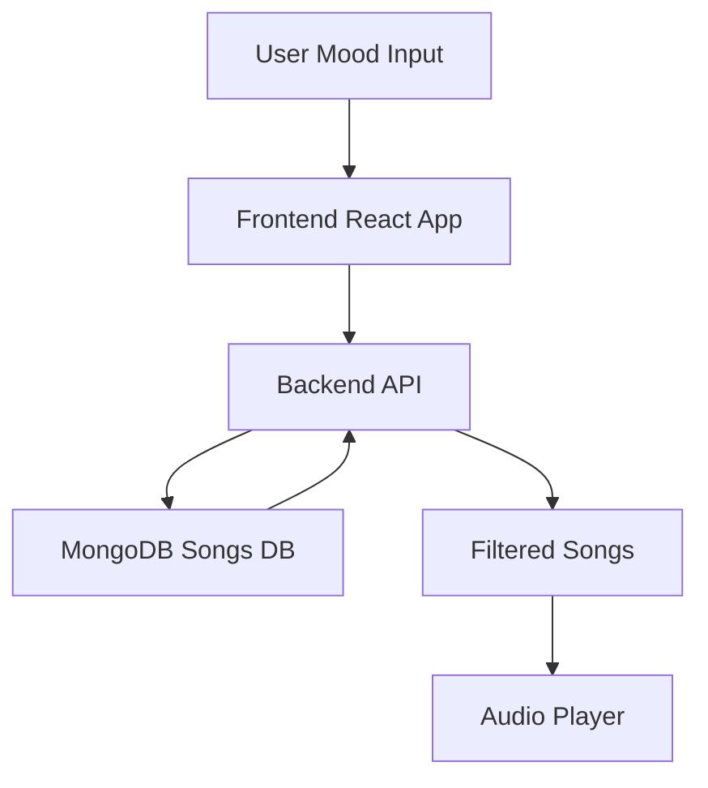

# 🎧 ModiBeats-AI  

<p align="center">
  
  
  
  
</p>

<p align="center">
  <b>🚀 Intelligent Music Player that understands your mood</b>
</p>

---

## 🌟 Features

- 🎯 Mood-Based Song Recommendation  
- ⚡ Real-Time Music Playback  
- 🔐 Authentication System  
- 📂 Playlist Management  
- 🧠 AI Ready Architecture  

---

## 🧠 How It Works



---

## 🏗️ Tech Stack

| Layer       | Technology |
|------------|-----------|
| Frontend    | React.js, Tailwind CSS |
| Backend     | Node.js, Express.js |
| Database    | MongoDB |
| DevOps      | Docker, GitHub Actions, Nginx |

---

## 📂 Project Structure

```bash
ModiBeats-AI/
├── client/          # React frontend
├── server/          # Node.js backend
├── docker/          # Docker configs
├── .github/         # CI/CD workflows
└── README.md
```

---

## 🔌 API Example

### 🎵 Recommend Songs

```http
POST /api/recommend
```

### Request
```json
{
  "mood": "chill"
}
```

### Response
```json
[
  {
    "title": "Song Name",
    "artist": "Artist",
    "url": "audio-url.mp3"
  }
]
```

---

## ⚙️ Setup Guide

### Clone Repo
```bash
git clone https://github.com/your-username/ModiBeats-AI.git
cd ModiBeats-AI
```

---

### Backend Setup
```bash
cd server
npm install
npm start
```

---

### Frontend Setup
```bash
cd client
npm install
npm run dev
```

---

## 🐳 Docker Setup

```bash
docker-compose up --build
```

---

## 📸 Screenshots

<p align="center">
  
</p>

---

## 🚀 Future Enhancements

- 🤖 AI Mood Detection (Face / Voice)
- 📊 Listening Analytics
- ⚡ WebSocket Real-Time Sync
- ☁️ AWS Deployment
- 🧠 ML Recommendation Engine

---

## 🧑‍💻 Author

**Shivaji Jagdale**

---

## ⭐ Support

If you like this project, give it a ⭐ on GitHub!
