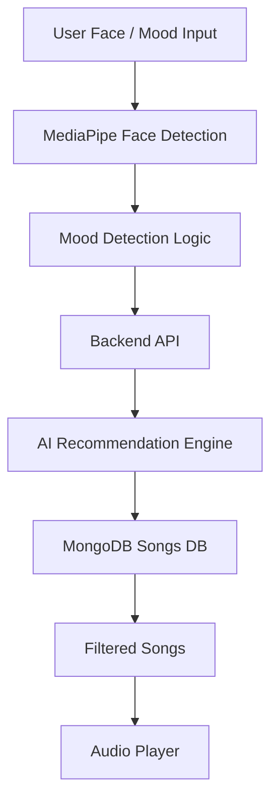

# 🎧 ModiBeats-AI  

<p align="center">
  
  
  
  
  
</p>

<p align="center">
  <b>🚀 AI-Powered Music Player with Mood Detection</b>
</p>

---

## 🌟 Features

- 🎯 Mood-Based Song Recommendation  
- 🤖 AI Playlist Generator (Gemini/OpenAI Ready)  
- 📸 Face Detection using MediaPipe  
- ⚡ Real-Time Music Playback  
- 🔐 Authentication System  
- 📂 Playlist Management  
- 🧠 Smart Recommendation Engine  

---

## 🧠 How It Works



---

## 🏗️ Tech Stack

| Layer       | Technology |
|------------|-----------|
| Frontend    | React.js, Tailwind CSS |
| Backend     | Node.js, Express.js |
| Database    | MongoDB |
| AI Layer    | MediaPipe, Gemini API / OpenAI |

---

## 🧠 AI Capabilities

- Detect user mood using face expressions (MediaPipe)
- Generate smart playlists using AI APIs
- Future support for:
  - 🎙️ Voice mood detection  
  - 📝 Auto Lyrics Generator  
  - 🎧 Personalized recommendations  

---

## 📂 Project Structure

```bash
ModiBeats-AI/
├── client/          # React frontend
├── server/          # Node.js backend
├── ai/              # AI logic (MediaPipe + API)
├── docker/          # Docker configs
├── .github/         # CI/CD workflows
└── README.md
```

---

## 🔌 API Example

### 🎵 Recommend Songs

```http
POST /api/recommend
```

### Request
```json
{
  "mood": "happy"
}
```

### Response
```json
[
  {
    "title": "Song Name",
    "artist": "Artist",
    "url": "audio-url.mp3"
  }
]
```

---

## ⚙️ Setup Guide

### Clone Repo
```bash
git clone https://github.com/your-username/ModiBeats-AI.git
cd ModiBeats-AI
```

---

### Backend Setup
```bash
cd server
npm install
npm start
```

---

### Frontend Setup
```bash
cd client
npm install
npm run dev
```

---

## 🐳 Docker Setup

```bash
docker-compose up --build
```

---

## 📸 Demo

> Add GIF showing face detection + music auto-play

---

## 🚀 Future Enhancements

- 🤖 Advanced AI Recommendations  
- ⚡ Real-Time Mood Sync (WebSockets)  
- ☁️ AWS Deployment  
- 📊 Listening Analytics  
- 🧠 ML-Based Recommendation Engine  

---

## 🧑‍💻 Author

**Shivaji Jagdale**

---

## ⭐ Support

If you like this project, give it a ⭐ on GitHub!
